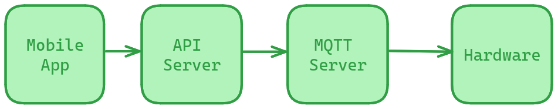

# The Braille Project

# How it works?
Simple flow diagram:



# The mobile app
Flutter based application and responsible for the followings:
- Image to text ocr using tesseract.
- Translating tamil to braille.
- Text speech using on-device api.
- Finally sends character to be displayed to api server.

# The API server
Flash based rest api and responsible for the followings:
- Host a api endpoint for mobile app to send character to be displayed.
- Converts the received character into binary format where each bit represents braille dot.
- Sends the converted binary data to MQTT server.

### To run:
```
$ cd api_server
$ pip install -r requirements.txt
$ python server.py
```

# MQTT Server
It's a message broker between api server and the hardware.

### To run:
Install [Mosquitto](https://mosquitto.org/)
```
$ cd mqtt_server
$ mosquitto -c mosquitto.conf
```

# Hardware
- Receives the binary data from mqtt server and based on each bits, pulls the pin down for 0 and pushes pin up for 1.

Components (for single character):
- 1x Esp32
- 3x DRV 8833
- 6x solenoids
